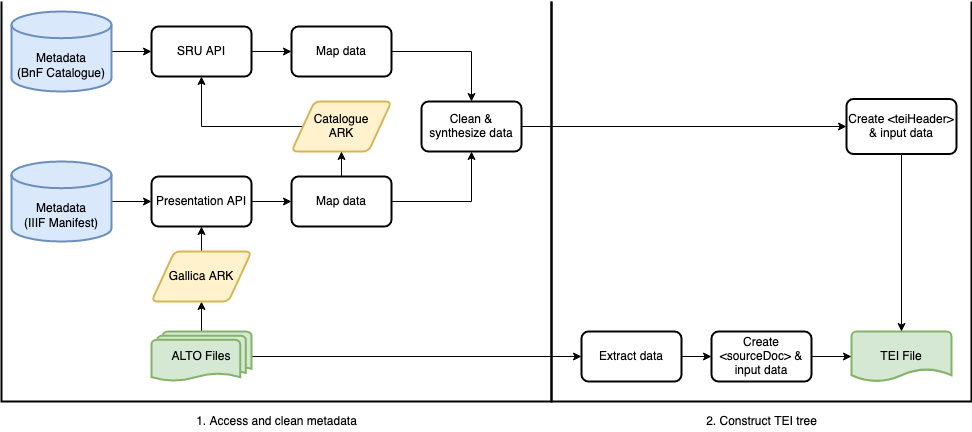
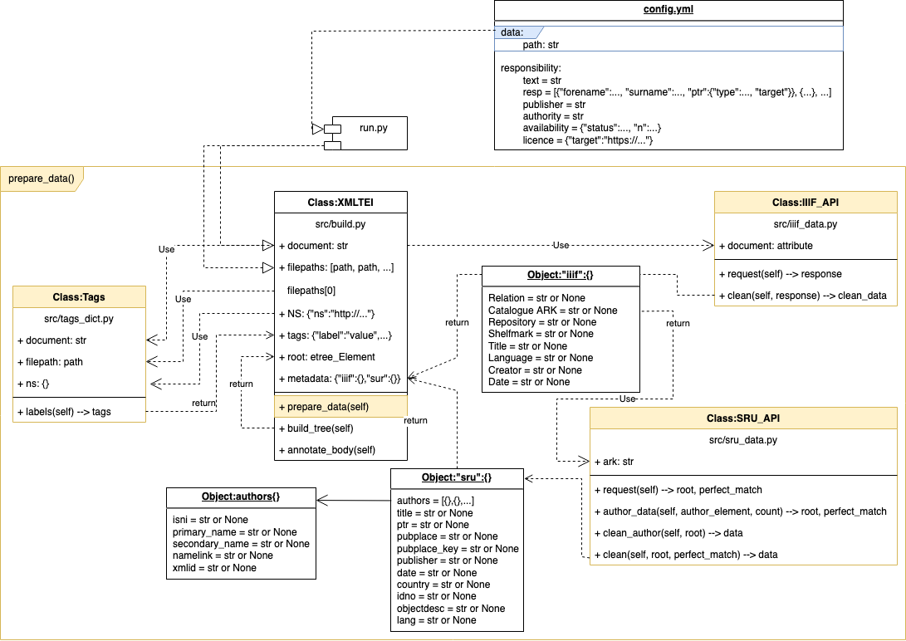
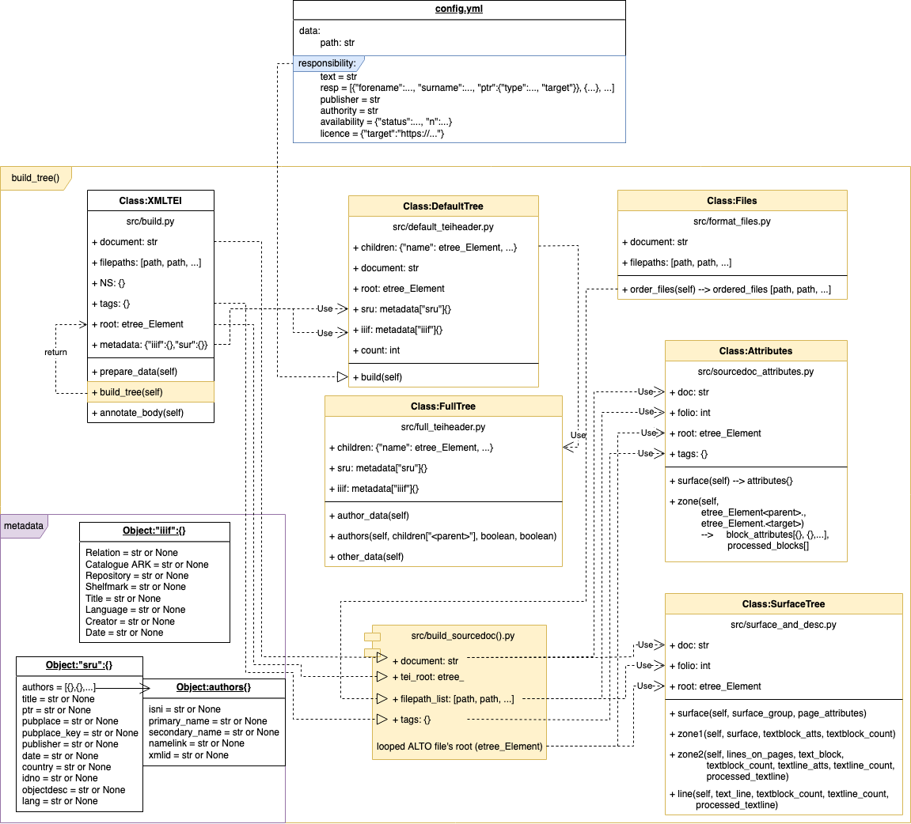

# ALTO4 to TEI P5
This application prepares a TEI edition of a digitzed document whose pages were transcribed and encoded in ALTO4 files using the HTR tool [eScriptorium](https://traces6.paris.inria.fr/).

It follows [SegmOnto's](https://github.com/SegmOnto/) controlled vocabulary and has been designed as part of the [Gallic(orpor)a](https://github.com/Gallicorpora) pipeline.

## Compatability
### Document Metadata
Currently, the application is designed to scrape metadata for the \<teiHeader\> from three resources related to the Bibliothèque nationale de France's Gallica repository.
   1. [Gallica's](https://api.bnf.fr/fr/api-iiif-de-recuperation-des-images-de-gallica) servers
   2. Bibliothèque nationale de France's [catalogue général](https://catalogue.bnf.fr)
   3. SUDOC's [Répertoire des centres de ressources](http://www.sudoc.abes.fr/cbs/xslt/)

Therefore, only transcriptions of digital exemplars from Gallica can take full advantage of the application's automatically generated \<teiHeader>. However, the URI syntax that this application uses to retrieve data from Gallica's servers is [the same syntax](https://iiif.io/api/image/3.0/) used by any other institution that participates, like the Bibliothèque nationale de France, in the IIIF. To adjust this URI and work with transcriptions of digital exemplars stored on other institutions' servers, edit the parameters "scheme," "server," and "prefix" in this application's configuration file. These parameters will be inserted into a string with the following pythonic syntax:
```python
f"{scheme}://{server}{manifest_prefix}{ARK}{manifest_suffix}"
```
The first three parameters in the IIIF URI can be modified in the configuration file as follows:
```yaml
  scheme: "https"
  server: "gallica.bnf.fr"
  manifest_prefix: "/iiif/ark:/12148/"
  image_prefix: "/iiif/ark:/12148/" # for Gallica, same as manifest
  manifest_suffix: "/manifest.json"
```
An example of this URI, constructed for the document with the ARK "bpt6k324358v" is:
>`https://gallica.bnf.fr/iiif/ark:/12148/bpt6k324358v/manifest.json`

The application has been designed and tested on IIIF manifest data typical of text documents distributed on Gallica. Its adaptability to how other institutions have encoded data in a IIIF manifest cannot be guaranteed.

### Transcription Data
The application can produce a \<sourceDoc> from any ALTO 4 files that were created by the Kraken engine, including those produced inside the eScriptorium interface. The source document does not need to be part of the Bibliothèque nationale de France's collections, its digital exemplars do not need to be distributed on Gallica, and the machine transcription does not need to have been made with models trained on the SegmOnto controlled vocabulary. The TEI element \<sourceDoc> that this application generates adapts to any ALTO 4 files that resemble the formats produced by Kraken's engine.
### Pre-Annotated Text Body
Currently, the application is designed to recognize zones and lines of text on a page whose labels conform to SegmOnto's controlled vocabulary. The application cannot generate a \<body> from ALTO-XML files in which a line or zone's `@TAGREF` is not part of the SemgOnto vocabulary.

### ALTO Tags
- The zone and line tags in the ALTO file need to follow the SegmOnto guidelines.

### File structure
- The application requires folders which contain each page's XML-ALTO4 file. The folder name must be the ARK identifier from Gallica.
- The ALTO4 files must be named with their folio number preceded by the letter `f`. They can include prefixes before the folio number. 

In example:

```
___data/
   |   btv1b8613380t.xml (TEI output)
   |   btv1b86146004.xml (TEI output)
   |___btv1b8613380t/
   |   |   btv1b8613380t_f4.xml (ALTO input)
   |   |   btv1b8613380t_f5.xml (ALTO input)
   |   |   ...
   |___btv1b86146004/
   |   |   f6.xml (ALTO input)
   |   |   f7.xml (ALTO input)
   |   |   ...

```
## Strategy
The document's metadata are extracted from two sources: the digitized document's IIIF manifest and the BnF's catalogue. Every Gallica source's IIIF manifest should include a valid reference to the document's ARK (Archival Resource Key) in the BnF catalogue. First, the application interacts with the IIIF Presentation API to access this key identifier as well as basic metadata about the document. All of the manifest's data is mapped and stored in case the document can't be located in the library catalogue. Second, the application uses the catalogue ARK indicated in the manifest to try to interact with the BnF catalogue's SRU API.

The identifier is valid when the very same document as that digitized, and only that document, is found in the library catalogue. The application parses the UNIMARC data and searches for information relevant to the `<teiHeader>`. If the identifier is invalid, the application relies exclusively on data retrieved from the digitized document's IIIF manifest. These two endpoints complement each other and compensate for missing data. However, the rich UNIMARC data is only used if the digitized document's exact match is found in the catalogue. This strict condition prevents any false data from being wrongly included in the XML-TEI file.



## Method. Task 1: Extract metadata from internet

The module `./transform/elements/api/teiheader_data.py` scrapes and cleans relevant metadata from the internet. The first endpoint is the digitized document's IIIF manifest. The manifest's response follows the IIIF community's recommendations and the data are sent in a dictionary.

**IIIF Manifest Data**

label in IIIF manifest | value | new dictionary key
|:--:|:--:|:--:|
`"Relation"`|uri to document in BnF catalogue (ex. ht<span>tp://catalogue.bnf.fr/ark:/...)|`"Relation"`
--|ARK component of `"Relation"` value|`"Catalogue ARK"`
`"Repository"`|name of conservation institution (BnF)|`"Repository"`
`"Shelfmark"`|document's shelfmark in conservation institution |`"Shelfmark"`
`"Title"`|title of document|`"Title"`
`"Language"`|language of document's text|`"Language"`
`"Creator"`|person accredited with document's creation|`"Creator"`
`"Date"`|date of document|`"Date"`

To acquire more detailed bibliographic information about the digitized document, the module also requests data from the BnF's SRU API. The response follows the Unimarc schema and the data are sent in XML.

**SRU API Unimarc Data**

|Unimarc data||value|new dictionary key|
|:--:|:--:|:--:|:--:|
|`@tag` of `<datafield>`|`@code` of `<subfield>`|||
||||
|200|a|clean title|`"title"`|
|210|a|place of publication|`"pubplace"`|
|102|a|place of publication's country code|`"pubplace_key"`|
|210|c|publisher|`"publisher"`|
|210|d|date of publication|`"date"`|
|801|a|conservation institution's country|`"country"`|
|930|a|conservation institution's shelfmark for the document|`"idno"`|
|200|a|document's type|`"objectdesc"`|
||||
||||**dict keys for list item, stored in key `"authors"`**|
|700 and/or 701|o|identifier if first four characters are `"ISNI"`|`"isni"`|
|700 and/or 701|a|author's primary name, typically the surname|`"primary_name"`|
|700 and/or 701|b|name links extracted from author's secondary name ("van der", "de la", "de", "du", "des", "von", "van")|`"namelink"`|
|700 and/or 701|b|author's secondary name, without name links|`"secondary_name"`|
--|--|concatanation of first 2 characters of primary name plus author's position in list|`"xmlid"`|
||||
|`@tag` of `<controlfield>`|--|||
|003|--|persistent ID given by the BnF (ex. ht<span>tp://catalogue.bnf.fr/ark:/...)|`"ptr"`|
   
### First phase's data structure and distribution



## Method. Task 2: Input doc metadata

The module `./transform/elements/teiheader.py` retrieves the dictionaries `manifest_data` and `unimarc_data` created in the first task and enters them into a TEI framework.

### 2.1. Create blank tree
First, an instantiation of the class `BlankTree` generates a default `<teiHeader>`. This tree is partially completed using default values dictated in the application's configuration file. These default data include who is responsible for the processed transcriptions, their transformation into a new TEI publication, etc. Certain elements in the blank tree are made accessible in the `BlankTree` class' method `.children`. These important XML-TEI elements are annotated in the example below with two asterisks.

```
<teiHeader>
   <fileDesc>
      <titleStmt>
      ** <title>...</title> --> .children["ts_title"]
      ** <author>...</author> --> .children["ts_author"]
         <respStmt> --> .children["respStmt"]
         ++ <resp>...</resp>
         ++ <persName>...</persName>
      </titleStmt>
      <extent>
      #  <measure unit="image" n=""/> --> .children["measure"]
      </extent>
      <publicationStmt> --> .children["publicationStmt"]
      ++ <publisher>...</publisher>
      ++ <authority>...</authority>
      ++ <availability status="", n="">
         ++ <licence target=""/>
         </availability>
      #  <date when=""/>
      </publicationStmt>
      <sourceDesc>
         <bibl>
         ** <ptr target=""/> --> .children["ptr"]
         ** <author ref="">...</author> --> .children["bib_author"]
         ** <title>...</title> --> .children["bib_title"]
         ** <pubPlace key="">...</pubPlace> --> .children["pubPlace"]
         ** <publisher>...</publisher> --> .children["publisher"]
         ** <date>...</date> --> .children["date"]
         </bibl>
         <msDesc>
            <msIdentifier>
            ** <country key=""/> --> .children["country"]
            ++ <settlement>...</settlement>
            ** <repository>...</repository> --> .children["respository"]
            ** <idno>...</idno> --> .children["idno"]
               <altIdentifier>
               #  <idno type="ark"/>
               </altIdentifier>
            </msIdentifier>
            <physDesc>
               <objectDesc>
               ** <p>...</p> --> .children["p"]
               </objectDesc>
            </physDesc>
         </msDesc>
      </sourceDesc>
   </fileDesc>
   <profileDesc>
      <langUsage>
      ** <language ident=""/> --> .children["language"]
      </langUsage>
   </profileDesc>
</teiHeader>
```

key|description
--|--
**|data in IIIF manifest and/or SRU API response
++|data drawn from mutable config file
\#|data automatically generated by application
-->|point to variable containing this eTree element
.children[]|class instance variable of `.teiheader.BlankTree`

### 2.2. Fill tree
After creating the blank tree, the module populates the child elements with their relevant data.

|XML-TEI element|`.children` key|`manifest_data` key|`unimarc_data` key|
|:--:|:--:|:--:|:--:|
|||||
|.//author /name|child of `"ts_author"` and `"bib_author"`|`"Creator"`|--|
|.//author @xml:id or @ref|descendant of `"ts_author"`and `bib_author`|generated upon input|`"authors"[i]["xmlid"]`|
|.//author /persName /forename|descendant of `"ts_author"` and `bib_author`|--|`"authors"[i]["secondary_name"]`|
|.//author /persName /namelink|descendant of `"ts_author"`and `bib_author`|--|`"authors"[i]["namelink"]`|
|.//author /persName /surname|descendant of `"ts_author"`and `bib_author`|--|`"authors"[i]["primary_name"]`|
|.//author /persName /ptr|descendant of `"ts_author"`and `bib_author`|--|`"authors"[i]["isni"]`|
|||||
|.//titleStmt /title|`"ts_title"`|`"Title"`|`"title"`|
|.//bibl /ptr @target|`"ptr"`|--|`"ptr"`|
|.//bibl /title|`"bib_title"`|`"Title"`|`"title"`|
|.//bibl /pupPlace|`"pubPlace"`|--|`"pubplace"`|
|.//bibl /pubPlace @key|`"pubPlace"`|--|`"pubplace_key"`|
|.//bibl /publisher|`"publisher"`|--|`"publisher"`|
|.//bibl /date|`"date"`|`"Date"`|`"date"`|
|.//msIdentifier /country @key|`"country"`|--|`"country"`|
|.//msIdentifier /repository|`"repository"`|`"Repository"`|--|
|.//msIdentifier /idno|`"idno"`|`"Shelfmark"`|`"idno"`|
|.//physDesc /objectDesc /p|`"p"`|--|`"objectdesc"`|
|.//profileDesc /langUsage /language|`"language"`|`"Language"`|--|
|.//profileDesc /langUsage /language @ident| `"language"`|--|`"lang"`|

### Second phase's data structure and distribution

